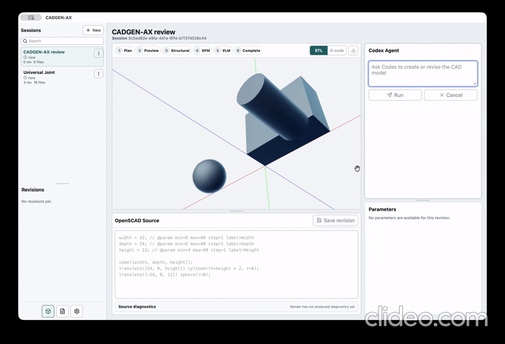
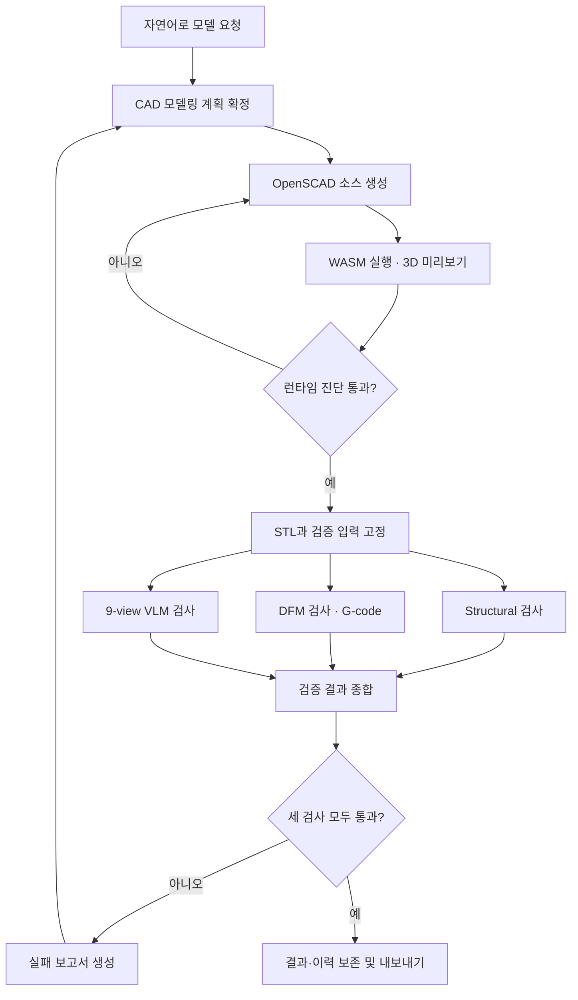
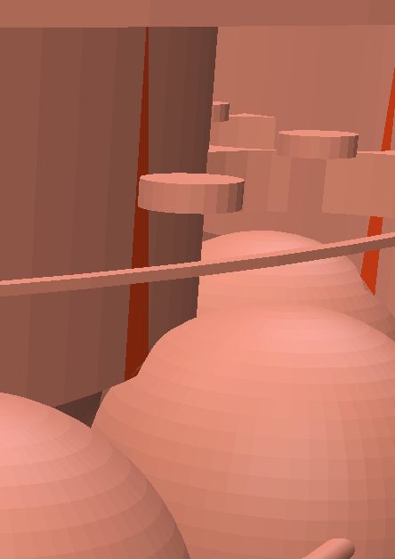
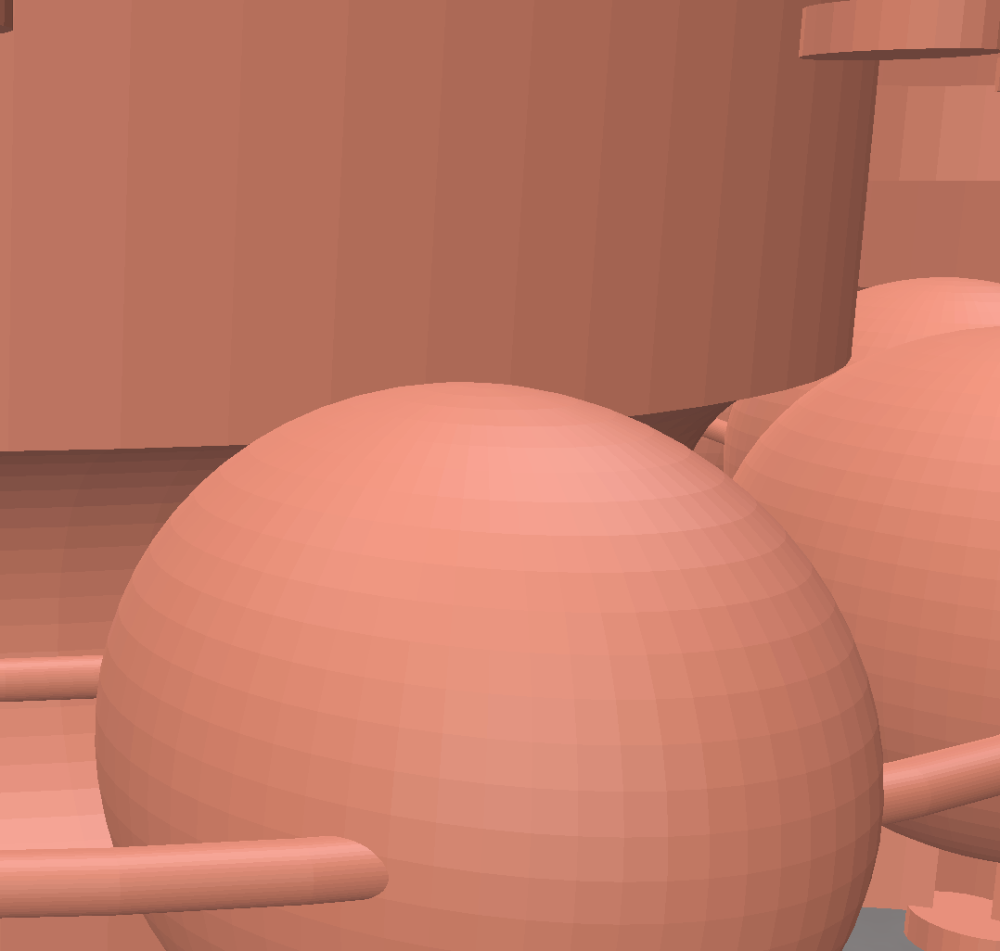
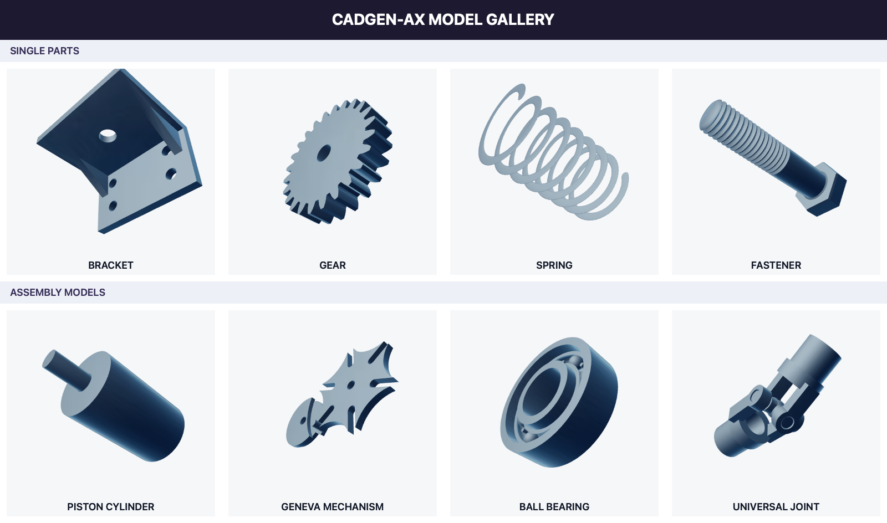
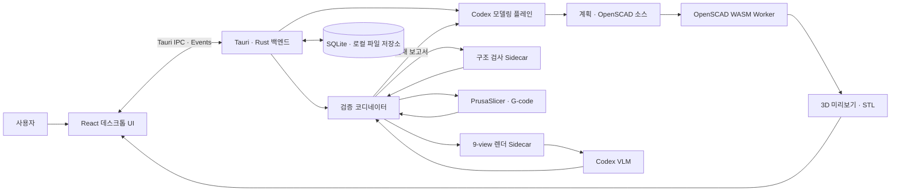
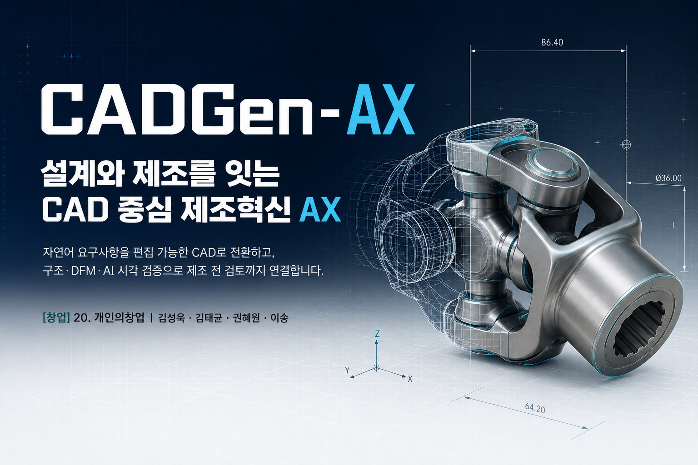

# CADGen-AX

> **말로 설명한 아이디어를, 실제로 만들 수 있는 설계로**

CADGen-AX는 CAD 경험이 적은 사용자도 일상적인 언어로 부품을 설명하면 **요구사항 정리 → 모델링 계획 → OpenSCAD 소스 → 3D 미리보기 → 구조·제조·시각 검증 → 반복 개선**까지 수행할 수 있도록 만든 AI 기반 설계 도우미입니다. 목표는 그럴듯한 3D 형상을 한 번 생성하는 데 그치지 않고, 사용자가 결과의 근거와 주의사항을 확인한 뒤 다음 설계·견적·제작 단계로 이어갈 수 있는 **검토 가능한 CAD+DFM 워크플로**를 제공하는 것입니다.

| 문제 | 해결 | 현재 구현 결과 |
| --- | --- | --- |
| 치수와 구성요소를 CAD 형상으로 옮기려면 전문 지식과 반복 작업이 필요함 | 자연어 요청을 모델링 계획과 OpenSCAD 소스로 변환 | 텍스트 요청부터 STL 내보내기까지 연결 |
| 생성된 메시만으로는 적용된 설계 판단과 수정 근거를 확인하기 어려움 | 계획·소스·파라미터·리비전·실행 기록을 함께 보존 | 직접 편집, 파라미터 변경, 리비전 비교 지원 |
| 보기 좋은 형상도 기하 오류나 선택한 공정에서의 출력 문제가 있을 수 있음 | Structural·DFM·VLM 검사를 분리하여 병렬 실행 | 3종 검증과 실패 보고서 기반 자동 개선 구현 |

**핵심 사용 흐름**


## 1. 문제 정의

### 1.1. 누구의 어떤 문제인가

머릿속의 기계 부품을 실제로 만들 수 있는 설계로 옮기려면 형상뿐 아니라 치수, 소재, 공차와 제조 공정 같은 조건을 함께 고려해야 합니다. 3D 프린팅과 디지털 제작을 활용하려는 학생, 메이커, 예비 창업자와 현장 실무자는 이 과정에서 다음 장벽을 만납니다.

1. CAD 프로그램의 조작법과 형상 설계 방식을 먼저 익혀야 합니다.
2. 치수나 구조를 변경할 때 모델을 다시 편집하거나 처음부터 만들어야 합니다.
3. 작은 조건 하나가 빠지거나 서로 맞지 않으면 이후 검토에서 여러 번의 수정과 재작업이 발생합니다.
4. 생성형 AI가 만든 형상이 겉보기에는 자연스러워도 기하학적으로 유효한지, 선택한 장비와 공정으로 출력 가능한지 판단하기 어렵습니다.
5. 여러 번 수정하면 어떤 요청, 가정과 오류 때문에 결과가 바뀌었는지 추적하기 어렵습니다.

따라서 이 프로젝트가 해결하려는 핵심 질문은 다음과 같습니다.

> **CAD 전문가가 아니어도 아이디어와 조건을 일상적인 언어로 전달하고, 검토 가능한 CAD 초안을 만든 뒤, 제작 전에 문제와 수정 이유를 확인할 수 있는가?**

### 1.2. 개발 목표

CADGen-AX의 목표는 단순히 3D 형상을 한 번 생성하는 것이 아니라, 생성 결과를 구조·제조·시각 관점에서 검증하고 실패 원인을 다시 설계에 반영하는 반복 가능한 CAD 워크플로를 제공하는 것입니다.

- 자연어 요구사항을 구성요소·치수·비율이 포함된 모델링 계획으로 정리
- 편집 가능한 OpenSCAD 소스와 STL 생성
- 소스 직접 편집과 파라미터 조절을 통한 사용자 주도 수정
- 구조적 오류, 선택한 출력 공정의 문제와 요청 불일치를 확인하는 3중 검증
- 검증 실패 원인을 다음 모델링 턴에 전달하는 자동 개선 루프
- 계획, 대화, 실행, 리비전, 검증 보고서와 산출물 계보를 보존하여 설계 근거와 수정 이유 확인

> **현재 MVP 범위**
>
> - 자연어 요청은 음성이 아닌 **텍스트 입력**으로 받습니다.
> - 형상과 치수를 중심으로 OpenSCAD 모델을 만들며, 명시되지 않은 세부 치수는 모델링 계획과 소스에서 확인할 수 있습니다.
> - 제조 검토는 사용자가 선택한 PrusaSlicer 프린터·공정 프로필을 기준으로 수행합니다.
> - 소재 물성 계산, 공차 해석과 실제 장비의 안전성 인증은 현재 범위에 포함되지 않습니다.

### 1.3. 대상 사용자와 기대 가치

| 대상 | 기존 어려움 | CADGen-AX가 제공하는 가치 |
| --- | --- | --- |
| 학생·메이커 | CAD 학습 없이 아이디어를 빠르게 형상화하기 어려움 | 자연어로 첫 모델을 만들고 소스와 파라미터로 학습·수정 |
| 예비 창업자 | 초기 시제품 설계의 반복 시간과 외주 비용 부담 | 아이디어 단계에서 여러 설계안을 빠르게 생성·검토 |
| 제품 설계자·현장 실무자 | 반복 설계에서 요구사항과 수정 근거가 흩어짐 | 계획·리비전·검증 보고서를 한 작업공간에서 추적 |
| 교육자 | 생성 결과만으로 설계 과정과 수정 근거를 설명하기 어려움 | 계획, 코드, 리비전과 검증 보고서를 함께 확인 |

## 2. 해결 방법

### 2.1. 핵심 아이디어

#### ① 자연어 요구사항을 검토 가능한 계획으로 정리한다

CADGen-AX의 핵심 차별점은 CAD 형상을 생성하는 것 자체가 아니라, 서로 독립적인 Structural·DFM·VLM 검증을 통해 생성 결과를 평가하고, 실패 원인을 다시 모델링 과정에 반영하여 자동으로 수정하는 반복 개선 루프에 있습니다.

#### ② 결과를 편집 가능한 CAD 코드로 남긴다

CADGen-AX는 최종 메시만 반환하지 않습니다. 확정한 계획을 바탕으로 OpenSCAD 소스를 생성하고, 사용자는 소스 또는 파라미터를 직접 변경할 수 있습니다. 동일한 소스에서 미리보기와 STL을 만들기 때문에 생성 결과와 내보낸 결과의 연결도 유지됩니다.

#### ③ 생성과 검증을 분리한다

하나의 평가 방식만으로는 CAD 결과의 모든 문제를 찾기 어렵습니다. CADGen-AX는 최종화된 동일 STL을 대상으로 다음 세 검사를 병렬 실행합니다.

| 검사 | 확인하려는 문제 | 주요 결과 |
| --- | --- | --- |
| Structural | Self-intersection, Manifold 여부 등 기하·위상 오류 | 구조 검사 보고서 |
| DFM | 선택한 프린터와 슬라이싱 프로필에서의 제작 가능성 | PrusaSlicer 진단과 G-code |
| VLM | 사용자 요청과 비교한 구조·구성요소·비율의 시각적 일치 | 9-view 평가와 항목별 점수 |

VLM은 구조·구성요소·비율을 각각 0~3점으로 평가합니다. 각 항목이 2점 이상이고 합계가 7점 이상일 때 통과합니다.

#### ④ 설계 근거와 수정 이유를 남긴다

계획, OpenSCAD 소스, 파라미터, 대화와 리비전을 함께 보존하여 AI가 어떤 구조를 적용했고 결과가 어떻게 바뀌었는지 확인할 수 있습니다. 세 검사 중 하나라도 기준을 통과하지 못하면 개별 결과를 종합한 실패 보고서를 새 모델링 턴에 전달하여 수정 이유도 남깁니다. 검사 실행 자체가 실패한 경우에는 빈 결과나 임의의 성공값으로 대체하지 않고 실행 실패로 기록합니다. 모든 검사를 통과했을 때만 해당 에이전트 실행을 완료합니다.

### 2.2. 사용자 흐름



**메인 Workspace**
[자연어 CAD 생성 Workspace](docs/images/workspace-overview.png)

### 2.3. 대표 사용 시나리오

예를 들어 사용자가 다음과 같이 요청합니다.

> “Nominal thread diameter는 M10, 전체 길이는 50 mm, thread pitch는 1.5 mm인 실제 나사산을 가진 육각 볼트를 만들어줘.”

1. 에이전트가 볼트 머리, 축, 나사산과 주요 치수를 모델 계획으로 정리합니다.
2. 계획을 바탕으로 파라메트릭 OpenSCAD 소스를 생성합니다.
3. OpenSCAD WASM이 소스를 실행하고 Three.js가 결과 메시를 표시합니다.
4. 사용자는 파라미터나 소스를 수정하거나 자연어로 변경을 요청할 수 있습니다.
5. 최종 STL에 Structural·DFM·VLM 검사를 실행합니다.
6. 실패하면 원인과 진단을 반영한 새 리비전을 만들고, 통과하면 STL과 G-code를 확인합니다.

단일 부품과 어셈블리에 사용한 전체 요청 예시는 [`sample/part/mechanical_part_queries.md`](sample/part/mechanical_part_queries.md)와 [`sample/assembly/assembly_quries.md`](sample/assembly/assembly_quries.md)에서 확인할 수 있습니다.

## 3. 개발 결과

### 3.1. 구현 범위

| 구분 | 구현 결과 |
| --- | --- |
| 자연어 모델링 | 모델 계획 커밋, OpenSCAD 소스 생성·수정, 단계별 실행 상태 표시 |
| CAD 실행 | Web Worker 기반 OpenSCAD WASM 실행, 진단과 STL 생성 |
| 3D 확인 | STL 메시와 G-code G0/G1 도구경로, 프린터 베드 시각화 |
| 사용자 편집 | OpenSCAD 소스 편집, 숫자·문자열·불리언 파라미터 변경 |
| 품질 검증 | Structural·DFM·VLM 병렬 검사와 종합 보고서 |
| 반복 개선 | 검증 실패 보고서를 반영한 새 계획과 소스 리비전 생성 |
| 추적성 | 세션, 대화, 실행 이벤트, 리비전, 검증 배치, 산출물 저장 |
| 복구 | 앱 재시작 시 진행 중이던 실행과 검증 상태 복구 또는 명시적 실패 처리 |
| 결과 내보내기 | 현재 리비전의 STL 및 생성된 G-code 내보내기 |

### 3.2. 검증 결과를 읽는 방법

최종화 시점의 STL, 실행 파일 해시와 DFM 프로필 내용을 고정한 후 세 검사를 시작합니다. 각 검사와 검증 배치는 `queued`·`running`·`succeeded`·`failed` 상태를 가지며, 품질 기준 미통과와 검사 프로세스 자체의 실패를 구분합니다.

```text
품질 기준 미통과  → 보고서 생성 → 다음 모델링 턴에서 형상 개선
검사 실행 실패    → 실패 상태와 원인 보존 → 사용자 재시도 또는 환경 수정
세 검사 모두 통과 → 실행 완료 → STL·G-code·보고서 보존
```

### 3.3 자동 개선 사례

#### 기하적 결함 발생

베어링 모델 생성시 홈의 크기와 내부 ball의 크기가 달라 접촉면이 생기며 Self-intersection이 발생하여 메쉬가 붕괴하는 기하적 결함 발생 (빨간색 삼각형)

  

#### 문제 코드

```
ball_pitch_r = 28.8; // 볼 중심
ball_r = 5.55; // 볼 반지름

inner_outer_r = 25.4;

module torus(major_r, minor_r) {
  rotate_extrude(convexity = 10)
    translate([major_r, 0, 0])
      circle(r = minor_r, $fn = 48);
}

module inner_ring_body() {
color([0.68, 0.71, 0.72])
    difference() {
      annulus(inner_outer_r, bore_r, bearing_width);
      torus(inner_outer_r + 0.45, 3.55);
    }
    ...
}
```

#### 에이전트의 수정

에이전트가 기하적 결함을 인지하고 볼의 반지름을 줄이면서 에러 해결

> 홈 중심 반지름 = 25.4 + 0.45 = 25.85 \
> 홈 단면 반지름 = 3.55 \
> 볼 중심 반지름 = 28.8 \
> 이너링의 바깥 경계 `r = 25.4`에서 홈이 끝나는 높이 \
> z ≈ 3.52 \
> 따라서 볼 중심에서 이너링의 최단 거리 \
> \sqrt{((28.8 - 25.4)² + 3.521²)} ≈ 4.895 \
> 반지름 ball_r = 4.80 으로 수정




### 3.4. 예시 결과물

현재 저장소에는 동일한 자연어 모델링 파이프라인으로 생성한 **단일 부품 10종과 어셈블리 6종, 총 16종**의 OpenSCAD 소스와 STL 예시가 포함되어 있습니다. 이 수치는 생성 자산의 범위를 나타내며, 모든 모델의 물리적 성능을 인증한다는 의미는 아닙니다.

#### 어셈블리

- 기어 쌍 (`gear_0.stl`)
- 피스톤–실린더 (`piston_cylinder_0.stl`)
- 제네바 메커니즘 (`geneva_machanism_1.stl`)
- 볼 베어링 (`ball_bearing_2.stl`)
- 리드 스크루–너트 (`lead_screw_wasm_3.stl`)
- 유니버설 조인트 (`universal_joint_wasm_0.stl`)

#### 단일 부품

- 평기어 (`gear.stl`)
- 단계축 (`shaft.stl`)
- L자형 마운팅 브래킷 (`bracket.stl`)
- 메커니컬 하우징 (`housing.stl`)
- 플랜지 허브 (`flange.stl`)
- M10 육각 볼트 (`fastener.stl`)
- 플랜지 부싱 (`bushing.stl`)
- 압축 코일 스프링 (`spring.stl`)
- V벨트 풀리 (`pulley.stl`)
- 방사형 디스크 캠 (`radial_cam.stl`)



<p align="center"><sub>앱의 WebGL Preview 설정으로 동일한 시점에서 렌더링한 단일 부품 4종과 어셈블리 4종</sub></p>

### 3.5. 주요 화면과 기능

#### 자연어 CAD 에이전트

1. 사용자가 원하는 물체, 크기와 특징을 자연어로 입력합니다.
2. 모델 계획, 소스 적용, 런타임 진단, 최종화의 진행 상태를 확인합니다.
3. 실행 중인 작업을 취소하거나 실패한 작업을 다시 시도할 수 있습니다.

#### 3D 미리보기와 편집

- 생성된 OpenSCAD 소스를 Web Worker에서 실행하여 UI 중단 없이 미리보기를 만듭니다.
- Three.js 뷰어에서 3D 메시를 회전·확대하여 확인합니다.
- 소스를 직접 편집하거나 모델 파라미터를 조절한 후 다시 렌더링합니다.
- STL과 DFM 검사에서 생성된 G-code 도구경로를 전환하여 확인합니다.

#### 세션과 리비전 관리

- 작업을 세션 단위로 생성, 검색, 이름 변경, 복제, 보관 및 삭제합니다.
- 각 수정본의 생성 시각, 소스 해시, 진단 결과와 연결된 실행을 확인합니다.
- 이전 리비전을 활성화하거나 현재 리비전과 비교할 수 있습니다.

#### 산출물 관리

- STL, G-code, 렌더 이미지와 개별·종합 검증 보고서를 한 세션에서 관리합니다.
- 산출물의 파일 상태와 무결성을 확인하고 필요한 결과를 내보냅니다.

### 3.6. 기존 방식과의 차이

아래 비교에서 기존 방식은 최종 메시 생성과 육안 확인에 초점을 둔 일반적인 Text-to-3D 흐름을 의미합니다.

| 구분 | 메시 중심 Text-to-3D 흐름 | CADGen-AX |
| --- | --- | --- |
| 결과물 | 편집하기 어려운 메시 중심 | OpenSCAD 소스, 파라미터와 STL |
| 수정 방식 | 프롬프트 재입력 또는 외부 CAD 도구 사용 | 자연어 재요청, 파라미터 변경, 소스 직접 편집 |
| 검증 | 결과의 육안 확인 중심 | 런타임 진단과 Structural·DFM·VLM 검사 |
| 개선 | 사용자가 실패 원인을 해석하여 다시 요청 | 종합 실패 보고서를 다음 모델링 턴에 자동 전달 |
| 추적성 | 생성 과정과 변경 근거 확인이 어려움 | 대화, 실행, 리비전, 검증과 산출물 계보 보존 |
| 실행 환경 | 서비스별로 상이 | CAD 실행·검증·데이터 저장은 로컬, AI 모델 사용에는 Codex 연결 필요 |

## 4. 상세 설계

### 4.1. 시스템 구성도



프론트엔드와 백엔드는 Tauri IPC 명령과 이벤트 스트림으로 통신합니다. 백엔드는 세션과 리비전뿐 아니라 검증 배치와 각 검사 상태를 저장하고, 애플리케이션 재시작 시 진행 중이던 에이전트 실행과 검증을 복구합니다.

### 4.2. 기술 선택과 이유

| 영역 | 기술 | 선택 이유 |
| --- | --- | --- |
| Desktop | Tauri 2.11 | 로컬 파일, 네이티브 Sidecar와 데스크톱 UI를 하나의 앱으로 연결 |
| Frontend | React 19, TypeScript 5.8, Vite 7 | 복합 작업공간 UI와 명시적인 상태·계약 관리 |
| 3D Preview | Three.js 0.178 | STL 메시와 G-code 도구경로를 동일 화면에서 시각화 |
| CAD Runtime | OpenSCAD WASM 0.0.4, Web Worker | 코드 기반 파라메트릭 CAD를 UI와 분리해 실행 |
| Backend | Rust stable, Tokio | 에이전트 실행, 검증 작업과 산출물 생명주기를 비동기로 관리 |
| Storage | SQLite (`rusqlite`) | 세션, 리비전, 메시지와 실행 상태를 로컬에 영속화 |
| Native Sidecars | C++, CMake | STL 구조 검사와 9-view PNG 렌더링 수행 |
| DFM | PrusaSlicer CLI | 실제 슬라이싱 프로필을 이용해 G-code와 제조 진단 생성 |
| Generative AI | OpenAI Codex | 자연어 요구 분석, 모델 계획과 OpenSCAD 코드 생성·수정 |
| Testing | Node test runner, TSX, Happy DOM, Cargo test | UI 계약, 워크플로와 백엔드 회귀 검증 |

### 4.3. 기능 명세

| ID | 기능 | 입력 | 결과 |
| --- | --- | --- | --- |
| F-01 | CAD 요청 | 자연어 프롬프트 | 모델 계획 및 에이전트 실행 생성 |
| F-02 | 소스 생성·수정 | 계획, 현재 소스, 실패 보고서 | OpenSCAD 소스 리비전 |
| F-03 | 미리보기 | OpenSCAD 소스와 파라미터 | 3D 메시 및 런타임 진단 |
| F-04 | 파라미터 편집 | 숫자·문자열·불리언 값 | 갱신된 소스와 미리보기 |
| F-05 | 병렬 모델 검증 | 고정된 STL, 계획, DFM 프로필, 사용자 요청 | Structural·DFM·VLM 검사와 종합 보고서 |
| F-06 | G-code 생성·미리보기 | STL과 PrusaSlicer 프로필 | G-code 산출물, 도구경로와 베드 시각화 |
| F-07 | 자동 개선 | 검증 실패 보고서 | 실패 문맥을 반영한 새 계획과 소스 리비전 |
| F-08 | 리비전 관리 | 활성화·복원·비교 요청 | 변경 이력이 보존된 새 상태 |
| F-09 | 결과 내보내기 | 현재 리비전, 저장 경로 | STL 또는 생성된 G-code 파일 |
| F-10 | 세션 관리 | 생성·검색·복제·보관·삭제 요청 | 로컬에 영속화된 작업 목록 |
| F-11 | 산출물 관리 | 열기·표시·삭제·검증 요청 | 파일 상태와 무결성 결과 |
| F-12 | 실행 복구 | 앱 재시작 또는 실패한 실행 | 에이전트·검증 상태 복구 또는 명시적 실패 |

### 4.4. 디렉터리 구조

```text
.
├── docs/                       # README 이미지와 제출 문서
├── fixtures/                   # 워크플로·검증 JSON 계약과 구조 검사 fixture
├── sample/
│   ├── assembly/               # 어셈블리 OpenSCAD·STL 예시 6종
│   └── part/                   # 단일 부품 OpenSCAD·STL 예시 10종
├── scripts/                    # CLI 정리와 네이티브 Sidecar 빌드 도구
├── src-tauri/
│   ├── prompts/                # 모델링·VLM 에이전트 프롬프트 템플릿
│   ├── sidecars/               # 구조 검사·VLM 렌더 C++ 소스
│   └── src/                    # Rust 백엔드, 저장소, 모델링·검증 플레인·CLI
├── tests/                      # TypeScript 통합 및 회귀 테스트
├── ui/
│   └── src/                    # React UI, Tauri 클라이언트, OpenSCAD Worker
├── package.json                # 프론트엔드·데스크톱 빌드 명령
└── rust-toolchain.toml         # Rust stable 도구 체인
```

## 5. 설치 및 사용 방법

### 5.1. 사전 요구사항

- Node.js 20 계열은 20.19 이상, 또는 Node.js 22.12 이상 및 npm
- Rust stable toolchain
- CMake와 플랫폼별 C/C++ 빌드 도구
- PrusaSlicer 2.x
- 설치·인증이 완료되어 `codex app-server`를 실행할 수 있는 Codex CLI
- 운영체제별 [Tauri 2 시스템 의존성](https://v2.tauri.app/start/prerequisites/)

### 5.2. 설치와 실행

```sh
git clone https://github.com/PNU-2026-AI-Hackathon/pnuai-c-04-individualstartup.git
cd pnuai-c-04-individualstartup
npm install
npm run dev:tauri
```

`npm run dev:tauri`는 Rust CLI 도구와 구조 검사·VLM 렌더 Sidecar를 debug 프로필로 빌드한 후 Tauri 개발 서버를 시작합니다.

### 5.3. 첫 실행 순서

1. Settings에서 PrusaSlicer 실행 파일의 절대 경로를 선택하고 검증·저장합니다.
2. 기본 DFM 프로필을 검토하거나 INI 프로필을 가져옵니다.
3. 새 세션을 만든 뒤 Workspace에서 만들 모델을 자연어로 요청합니다.
4. STL 미리보기, OpenSCAD 소스, 파라미터와 진행 상태를 확인합니다.
5. 검증이 끝나면 Structural·DFM·VLM·Combined 보고서와 G-code를 확인합니다.
6. Artifacts에서 STL 또는 G-code를 내보내고 세션 산출물을 관리합니다.

### 5.4. 검증과 빌드

각 명령은 검사 또는 빌드 실패 시 0이 아닌 종료 코드로 중단됩니다.

```sh
npm run check
npm test
npm run test:rust
npm run build
npm run build:tauri
```

## 6. 한계와 향후 계획

CADGen-AX는 창업 아이디어와 핵심 기술 흐름을 검증하기 위한 MVP입니다. 현재 범위와 이후 개선 방향은 다음과 같습니다.

| 현재 한계 | 향후 계획 |
| --- | --- |
| 자연어 요청을 텍스트로 입력하며 음성 입력과 대화형 누락 조건 확인은 지원하지 않음 | 음성 입력과 치수·용도·공정 조건을 단계적으로 확인하는 요구사항 인터뷰 추가 |
| OpenSCAD의 CSG 표현에 적합한 기계 형상을 중심으로 지원 | 자유곡면과 더 다양한 CAD 커널·내보내기 형식 검토 |
| 어셈블리의 배치와 간섭을 확인하지만 전체 운동 범위를 물리 시뮬레이션하지는 않음 | 운동학·공차·간섭 검증 확장 |
| DFM 결과가 선택한 프린터와 슬라이싱 프로필에 의존하며 소재 물성·공차를 직접 해석하지 않음 | 소재·공차 지식과 재료·프린터별 프로필, 출력 품질 지표 확대 |
| VLM 평가는 시각적 판단을 보조하며 물리적 안전성을 인증하지 않음 | 반복 평가, 기준 데이터와 사용자 평가를 통한 신뢰도 측정 |
| CAD 작업과 데이터는 로컬에서 처리하지만 AI 모델 사용에는 Codex 연결 필요 | 연결 실패 복구와 지원 실행 환경 명확화 |
| 현재는 개발 환경 중심의 데스크톱 프로토타입 | 플랫폼별 패키징, 설치 과정과 사용성 평가 고도화 |

## 7. 사회적 가치

- CAD 교육을 받기 어려운 학생, 메이커와 예비 창업자의 디지털 제작 진입 장벽 완화
- 초기 시제품 설계에 필요한 반복 시간과 외주 비용 절감 가능성
- 제조 현장의 아이디어를 검토 가능한 CAD 초안으로 빠르게 옮기고 제작 전 문제를 발견하도록 지원
- 코드와 파라미터가 남는 결과물을 통한 생성형 AI 결과의 설명 가능성과 수정 가능성 강화
- 교육용 가이드와 예제 모델을 활용한 설계 학습 기회 확대

## 8. 소개 및 시연 영상

[](https://youtu.be/THNZbOqVQsM?si=MKESyMzIVFIMEyv2)


## 9. 팀 소개

| 김성욱 | 김태균 | 권혜원 | 이송 |
| :---: | :---: | :---: | :---: |
| <a href="https://github.com/wannabidr"></a> | <a href="https://github.com/gyuun"></a> | <a href="https://github.com/hyerom"></a> | <a href="https://github.com/song9110"></a> |
| sungwooki9@pusan.ac.kr | csegyuun@pusan.ac.kr | hyerom@pusan.ac.kr | thd3040@naver.com |
| Lead | System Engineer | UI/UX Engineer | QA Engineer |

## 10. 프로젝트를 통해 확인한 점

생성된 CAD 코드가 컴파일된다는 사실만으로는 모델이 사용자의 요청에 맞거나 제작 가능하다고 판단할 수 없었습니다. 이 문제를 해결하기 위해 생성 단계와 검증 단계를 분리하고, 기하 구조·슬라이싱·시각적 요구 충족 여부를 각각 확인하는 구조를 설계했습니다.

또한 AI 결과를 한 번 보여주는 것보다 계획, 소스, 파라미터, 실패 원인과 변경 이력을 남기는 것이 사용자가 결과를 신뢰하고 직접 개선하는 데 중요하다는 점을 확인했습니다. 앞으로는 실제 사용자 평가와 출력 실험을 추가하여 생성 성공 여부를 넘어 설계 시간 단축과 결과 품질을 정량적으로 측정할 계획입니다.
