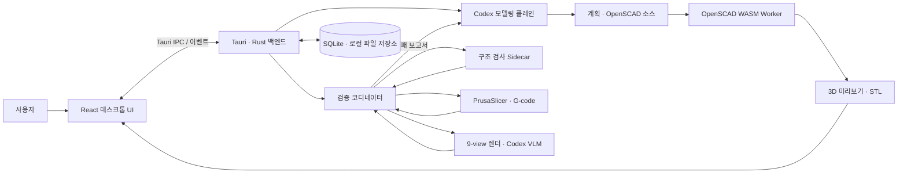
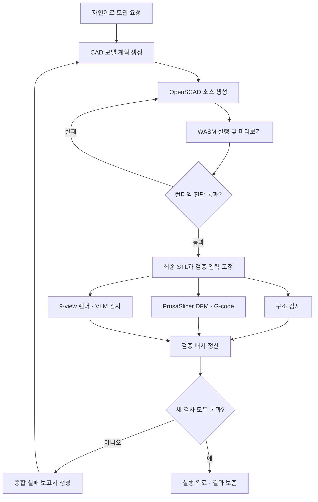

# CADGen-AX

> 자연어로 아이디어를 설명하면, 편집 가능한 OpenSCAD 모델과 STL 결과물을 만드는 AI 기반 데스크톱 CAD 워크스페이스

CADGen-AX는 CAD 경험이 적은 사용자도 텍스트로 요구사항을 전달하고, 생성된 3D 모델을 미리보기·수정·검증·내보내기까지 할 수 있도록 돕는 데스크톱 프로토타입입니다.

> 개발 이력: 본 저장소는 비공개 창업용 프로토타입 저장소에서 해커톤 저장소로 이전되었으며, 이전 개발 이력은 원래 커밋 작성일과 함께 보존되어 있습니다. 논문 제출용 저장소는 블라인드 정책에 따라 비공개 처리되었습니다.

## 1. 프로젝트 소개

### 1.1. 개발 배경 및 필요성

3D 프린팅과 디지털 제작의 활용 범위는 넓어지고 있지만, 일반 사용자가 아이디어를 실제 제작 가능한 3D 모델로 옮기려면 CAD 도구의 조작법과 형상 설계 방식을 먼저 익혀야 합니다. 기존 생성형 AI로 3D 형상을 만들더라도 결과가 단순한 이미지나 수정하기 어려운 메시로 끝나거나, 생성 결과의 구조적 타당성과 변경 이력을 확인하기 어려운 경우가 있습니다.

CADGen-AX는 자연어를 매개로 CAD 설계 진입 장벽을 낮추면서도, 결과물을 코드 기반 파라메트릭 모델로 남겨 사용자가 직접 확인하고 수정할 수 있도록 하기 위해 시작했습니다.

### 1.2. 개발 목표 및 주요 내용

프로젝트의 목표는 **자연어 요청부터 검증 가능한 CAD 결과물까지 하나의 데스크톱 작업공간에서 연결하는 것**입니다.

- 자연어 요구사항을 분석해 모델링 계획과 OpenSCAD 소스 생성
- Web Worker 기반 OpenSCAD 실행 및 3D 메시 미리보기
- 모델 파라미터 조절과 소스 직접 편집
- 구조·DFM·VLM 검사를 병렬 실행하고 실패 보고서로 모델을 반복 개선
- STL과 슬라이싱된 G-code를 각각 3D로 미리보기
- 세션, 대화, 리비전, 검증 배치와 산출물을 로컬에 영속화
- 최종 모델을 STL 파일로 내보내기

### 1.3. 세부 내용

사용자가 모델을 요청하면 모델링 에이전트가 주요 구성 요소와 예상 비율을 포함한 계획을 먼저 확정하고 OpenSCAD 소스를 작성합니다. 애플리케이션은 생성된 소스를 OpenSCAD WASM 런타임으로 실행해 미리보기와 진단 결과를 만들며, 소스 오류가 없을 때 최종 STL을 고정합니다.

최종화 이후에는 모델링과 분리된 검증 플레인이 동일한 STL을 대상으로 구조 검사, PrusaSlicer DFM 검사, 9-view 렌더 기반 VLM 검사를 병렬 실행합니다. 세 검사의 입력과 결과는 하나의 검증 배치로 저장됩니다. 하나라도 기준을 통과하지 못하면 종합 실패 보고서를 새 모델링 턴에 전달하고, 모두 통과하면 해당 에이전트 실행을 완료합니다. 검사 실행 자체가 실패한 경우에는 결과를 꾸미지 않고 실행 실패로 기록합니다.

사용자는 AI 생성 결과를 그대로 받는 데 그치지 않고 소스, 파라미터, 리비전 차이, 실행 로그, 개별·종합 검증 보고서와 산출물을 같은 화면에서 확인할 수 있습니다. STL 메시와 G-code 도구경로는 Three.js 뷰어에서 전환할 수 있으며, G-code 화면에는 슬라이싱 프로필의 베드 형상도 함께 표시됩니다. 모든 세션 상태는 로컬 SQLite 데이터베이스와 파일 시스템에 보존됩니다.

### 1.4. 기존 서비스 대비 차별성

| 구분 | 일반적인 Text-to-3D 방식 | CADGen-AX |
| --- | --- | --- |
| 결과물 | 편집이 어려운 메시 또는 이미지 중심 | 수정 가능한 OpenSCAD 소스와 STL 동시 제공 |
| 수정 방식 | 프롬프트를 다시 입력하거나 외부 도구 사용 | 자연어 재요청, 파라미터 변경, 소스 직접 편집 |
| 검증 | 생성 결과의 육안 확인 중심 | 런타임 진단과 구조·DFM·VLM 병렬 검증을 워크플로에 포함 |
| 추적성 | 생성 과정과 변경 근거 확인이 어려움 | 세션별 대화, 실행 이벤트, 리비전, 검증 배치 및 산출물 계보 보존 |
| 실행 환경 | 웹 서비스 또는 외부 서버 의존 | 로컬 데스크톱 앱에서 프로젝트 데이터와 산출물 관리 |

### 1.5. 사회적 가치 도입 계획

- CAD 교육을 받기 어려운 예비 창업자, 메이커와 학생의 디지털 제작 진입 장벽 완화
- 초기 시제품 설계에 필요한 반복 시간과 외주 비용 절감
- 코드와 파라미터가 남는 결과물을 통해 생성형 AI 결과의 설명 가능성과 수정 가능성 강화
- 향후 교육용 가이드, 예제 모델과 접근성 개선을 통해 아이디어 검증 기회의 격차 축소

## 2. 상세 설계

### 2.1. 시스템 구성도



프론트엔드와 백엔드는 Tauri IPC 명령, `cad_bridge_event` 상태 스냅샷과 `agent_stream_event` 스트림으로 통신합니다. 미리보기와 STL 내보내기는 동일한 OpenSCAD WASM 실행 결과를 사용합니다. 백엔드는 세션·리비전뿐 아니라 검증 배치와 각 검사 상태를 저장하고, 재시작 시 진행 중이던 에이전트 실행과 검증을 복구합니다.

### 2.2. 사용 기술

| 영역 | 기술 | 용도 |
| --- | --- | --- |
| Desktop | Tauri 2.11 | 네이티브 데스크톱 셸과 IPC |
| Frontend | React 19, TypeScript 5.8, Vite 7 | 작업공간 UI와 상태 관리 |
| 3D Preview | Three.js 0.178 | STL 메시, G-code 도구경로와 프린터 베드 시각화 |
| CAD Runtime | OpenSCAD WASM 0.0.4, Web Worker | OpenSCAD 평가, 미리보기 및 STL 생성 |
| Backend | Rust stable, Tokio | 세션·에이전트 실행·산출물 관리 |
| Storage | SQLite (`rusqlite`) | 세션, 리비전, 메시지와 실행 상태 영속화 |
| Native Sidecars | C++, CMake | STL 구조 검사와 VLM용 9-view PNG 렌더링 |
| DFM | PrusaSlicer CLI | 저장된 프로필 기반 슬라이싱과 G-code/진단 검사 |
| Generative AI | OpenAI Codex | 자연어 요구 분석, 모델 계획 및 OpenSCAD 코드 생성·수정 |
| Testing | Node test runner, TSX, Happy DOM, Cargo test | UI 계약, 워크플로와 백엔드 회귀 검증 |

## 3. 개발 결과

### 3.1. 전체 시스템 흐름도



최종화 시점의 STL, 실행 파일 해시와 DFM 프로필 내용을 고정한 뒤 세 검사를 동시에 시작합니다. 각 검사와 배치의 `queued`·`running`·`succeeded`·`failed` 상태, 보고서와 후속 수정 연결을 저장하므로 앱 재시작 후에도 워크플로를 복구할 수 있습니다. 검사가 정상 실행되었지만 품질 기준을 통과하지 못한 경우와 검사 자체의 운영 실패는 별도로 처리합니다.

### 3.2. 기능 설명

#### 자연어 CAD 에이전트

- 사용자가 원하는 물체, 크기와 특징을 자연어로 입력합니다.
- 모델 계획 커밋, 소스 적용, 런타임 진단, 최종화의 단계별 진행을 확인합니다.
- 모델링과 시각 검증을 서로 분리된 Codex 스레드에서 실행합니다.
- 실행 중 취소하거나 실패한 작업을 다시 시도할 수 있습니다.

#### 3D 미리보기 및 편집

- 생성된 OpenSCAD 소스를 Web Worker에서 실행해 UI 중단 없이 미리보기를 만듭니다.
- Three.js 뷰어에서 생성된 3D 메시를 회전·확대해 확인합니다.
- 소스를 직접 편집하거나 노출된 모델 파라미터를 조절해 다시 렌더링합니다.
- DFM 검사에서 생성된 G-code의 G0/G1 도구경로와 베드 격자를 확인합니다.

#### 검증 및 결과물 관리

- OpenSCAD 컴파일 오류를 진단 정보로 표시합니다.
- 하나의 배치에서 구조·DFM·VLM 검사를 병렬 실행하고 각 검사 상태를 실시간으로 표시합니다.
- 구조, DFM, VLM 및 종합 보고서를 실행 내역에서 펼쳐볼 수 있습니다.
- VLM은 구조·구성요소·비율을 각각 0~3점으로 평가하며, 각 항목 2점 이상이면서 합계 7점 이상이어야 통과합니다.
- Settings에서 PrusaSlicer 절대 실행 경로를 검증하고, INI 프로필을 검색·편집·가져오기·내보내기할 수 있습니다.
- 미리보기 메시, STL, G-code, 메타데이터와 9-view 렌더 이미지를 세션별로 관리합니다.
- 산출물 무결성을 확인하고 파일을 열거나 원하는 위치로 내보냅니다.

#### 세션 및 리비전 관리

- 모델링 작업을 세션 단위로 생성, 검색, 이름 변경, 복제, 보관 및 삭제합니다.
- 각 수정본의 생성 시각, 소스 해시, 진단 결과와 연결된 실행을 확인합니다.
- 이전 리비전을 활성화하거나 복원하고 현재 리비전과 비교할 수 있습니다.

### 3.3. 기능 명세서

| ID | 기능 | 입력 | 결과 |
| --- | --- | --- | --- |
| F-01 | CAD 요청 | 자연어 프롬프트 | 모델 계획 및 에이전트 실행 생성 |
| F-02 | 소스 생성·수정 | 계획, 현재 소스, 실패 보고서 | OpenSCAD 소스 리비전 |
| F-03 | 미리보기 | OpenSCAD 소스와 파라미터 | 3D 메시 및 런타임 진단 |
| F-04 | 파라미터 편집 | 숫자·문자열·불리언 값 | 갱신된 소스와 미리보기 |
| F-05 | 병렬 모델 검증 | 고정된 STL, 계획, DFM 프로필, 사용자 요청 | 구조·DFM·VLM 검사와 종합 보고서 |
| F-06 | G-code 생성·미리보기 | STL과 PrusaSlicer 프로필 | G-code 산출물, 도구경로와 베드 시각화 |
| F-07 | 자동 개선 | 검증 실패 보고서 | 실패 문맥을 반영한 새 계획과 소스 리비전 |
| F-08 | 리비전 관리 | 활성화·복원·비교 요청 | 변경 이력이 보존된 새 상태 |
| F-09 | STL 내보내기 | 최종 리비전, 저장 경로 | 미리보기와 동일한 STL 파일 |
| F-10 | 세션 관리 | 생성·검색·복제·보관·삭제 요청 | 로컬에 영속화된 작업 목록 |
| F-11 | 산출물 관리 | 열기·표시·삭제·검증 요청 | 파일 상태와 무결성 결과 |
| F-12 | 실행 복구 | 앱 재시작 또는 실패한 실행 | 에이전트·검증 상태 복구 또는 명시적 실패 |

### 3.4. 디렉터리 구조

```text
.
├── docs/                       # 사업계획서, 발표자료 등 제출 문서
├── fixtures/                   # 워크플로·검증 JSON 계약과 구조 검사 fixture
├── sample/                     # CADGen-AX로 생성한 예시 STL 6종
├── scripts/                    # OpenSCAD 실행, CLI 정리, 네이티브 sidecar 빌드 도구
├── src-tauri/
│   ├── prompts/                # 모델링·VLM 에이전트 프롬프트 템플릿
│   ├── sidecars/               # 구조 검사·VLM 렌더 C++ 소스
│   └── src/                    # Rust 백엔드, SQLite, 에이전트·검증 플레인·CLI
├── tests/                      # TypeScript 통합 및 회귀 테스트
├── ui/
│   └── src/                    # React UI, Tauri 클라이언트, OpenSCAD Worker
├── package.json                # 프론트엔드·데스크톱 빌드 명령
└── rust-toolchain.toml         # Rust stable 도구 체인
```

### 3.5. AI 도구 활용

#### 제품 기능

Codex를 서로 역할이 다른 두 플레인에 연결했습니다. 모델링 플레인은 사용자의 자연어 요청, 현재 리비전과 이전 실패 보고서를 바탕으로 계획을 세우고 OpenSCAD 소스를 생성·수정합니다. 검증 플레인의 격리된 VLM 평가자는 앱이 만든 단일 9-view 이미지와 고정된 계약만 받아 형상·구성요소·비율 점수를 제출합니다. 점수 판정, 보고서 조합과 후속 수정 실행은 애플리케이션이 담당합니다.

#### 개발 과정

AI 코딩 도구를 요구사항 구체화, 인터페이스 설계, 반복 구현, 테스트 작성과 리팩터링에 활용했습니다. 생성된 코드는 타입 검사, 프론트엔드 테스트, Rust 테스트와 실제 빌드로 검증했으며, 커밋을 기능 단위로 나누어 변경 과정을 추적할 수 있도록 했습니다.

## 4. 설치 및 사용 방법

### 4.1. 사전 요구사항

- Node.js 20 계열은 20.19 이상, 또는 Node.js 22.12 이상 및 npm
- Rust stable toolchain
- CMake와 플랫폼별 C/C++ 빌드 도구
- PrusaSlicer 2.x (앱 Settings에서 실제 실행 파일의 절대 경로 지정)
- 설치·인증이 완료되어 `codex app-server`를 실행할 수 있는 Codex CLI
- 운영체제별 [Tauri 2 시스템 의존성](https://v2.tauri.app/start/prerequisites/)

### 4.2. 설치

```sh
git clone https://github.com/PNU-2026-AI-Hackathon/pnuai-c-04-individualstartup.git
cd pnuai-c-04-individualstartup
npm install
```

### 4.3. 실행

전체 데스크톱 애플리케이션을 실행합니다. 이 명령은 Rust CLI 6종과 구조 검사·VLM 렌더 sidecar를 debug 프로필로 먼저 빌드한 뒤 Tauri 개발 서버를 시작합니다.

```sh
npm run dev:tauri
```

프론트엔드 화면만 개발할 때는 다음 명령을 사용합니다. 백엔드 기능은 Tauri 환경에서만 동작합니다.

```sh
npm run dev:ui
```

### 4.4. 검증 및 빌드

각 검증 명령은 실패 시 0이 아닌 종료 코드로 중단됩니다.

```sh
npm run check
npm test
npm run test:rust
npm run build
npm run build:tauri
```

개별 빌드 명령은 다음과 같습니다.

```sh
npm run build:sidecar          # debug 구조 검사·VLM 렌더 sidecar
npm run build:sidecar:release  # release sidecar
npm run build:cli-tools        # Rust CLI 전체 + debug sidecar
```

GUI가 없는 macOS 빌드 환경에서 DMG를 만들 때는 Finder 꾸미기 단계를 건너뛰도록 `CI=true npm run build:tauri`를 사용합니다.

패키징된 macOS 앱은 터미널의 `PATH`를 그대로 상속하지 않을 수 있습니다. 백엔드는 현재 경로, 앱 인접 CLI 경로, 로그인 셸 경로와 `CADASTROPHE_CODEX_EXTRA_PATHS`에 지정된 경로를 조합해 Codex 실행 파일을 찾습니다.

### 4.5. 첫 실행 순서

1. 앱의 Settings에서 PrusaSlicer 실행 파일을 선택하고 검증·저장합니다.
2. 기본 DFM 프로필을 검토하거나 INI 프로필을 가져와 저장합니다.
3. 새 세션을 만든 뒤 Workspace에서 만들 모델을 자연어로 요청합니다.
4. STL 미리보기, 소스, 파라미터와 진행 상태를 확인합니다.
5. 검증이 끝나면 Structural·DFM·VLM·Combined 보고서와 G-code 미리보기를 확인합니다.
6. Artifacts에서 STL을 내보내거나 G-code·렌더 이미지 등 세션 산출물을 관리합니다.

### 4.6. 예시 결과물

`sample/`에는 현재 파이프라인으로 생성한 STL 예시가 포함되어 있습니다.

- 기어 (`gear_0.stl`)
- 피스톤 실린더 (`piston_cylinder_0.stl`)
- 제네바 메커니즘 (`geneva_machanism_1.stl`)
- 볼 베어링 (`ball_bearing_2.stl`)
- 리드 스크루 (`lead_screw_wasm_3.stl`)
- 유니버설 조인트 (`universal_joint_wasm_0.stl`)

## 5. 소개 및 시연 영상

> TODO: 센터에서 YouTube URL을 전달받은 뒤 소개 및 시연 영상 링크를 추가합니다.

## 6. 팀 소개

| 김성욱 | 김태균 | 권혜원 | 이송 |
| :---: | :---: | :---: | :---: |
|<a href="https://github.com/wannabidr"></a>| <a href="https://github.com/gyuun"></a>|<a href="https://github.com/hyerom"></a>| — |
| sungwooki9@pusan.ac.kr | csegyuun@pusan.ac.kr | hyerom@pusan.ac.kr | thd3040@naver.com |
| Lead | System Engineer | UI/UX Engineer | QA Engineer |

## 7. 해커톤 참여 후기

> TODO: 해커톤 종료 후 문제 정의, 구현 과정에서의 학습, 검증 결과와 향후 개선점을 작성합니다.

---

현재 버전은 창업 아이디어 검증을 위한 MVP입니다. 제품화 단계에서는 지원 형상과 내보내기 형식 확대, 플랫폼별 배포 안정화, 사용성 평가 및 생성 결과 품질 지표 고도화를 진행할 예정입니다.
