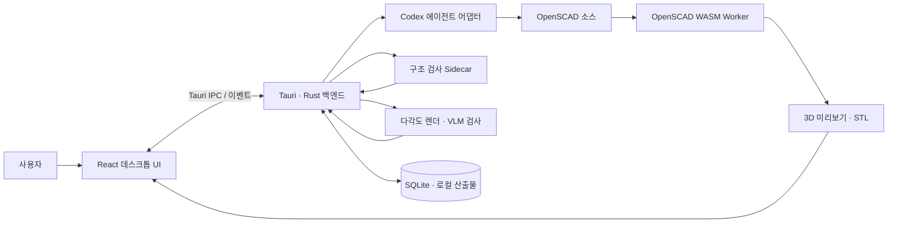
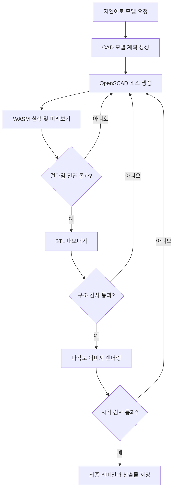

# Cadastrophe

> 자연어로 아이디어를 설명하면, 편집 가능한 OpenSCAD 모델과 STL 결과물을 만드는 AI 기반 데스크톱 CAD 워크스페이스

Cadastrophe는 CAD 경험이 적은 사용자도 텍스트로 요구사항을 전달하고, 생성된 3D 모델을 미리보기·수정·검증·내보내기까지 할 수 있도록 돕는 프로토타입입니다.

> 개발 이력 안내: 본 저장소는 비공개 프로토타입 저장소에서 해커톤 저장소로 이전되었으며, 이전 개발 이력은 원래 커밋 작성일과 함께 보존되어 있습니다.

## 1. 프로젝트 소개

### 1.1. 개발 배경 및 필요성

3D 프린팅과 디지털 제작의 활용 범위는 넓어지고 있지만, 일반 사용자가 아이디어를 실제 제작 가능한 3D 모델로 옮기려면 CAD 도구의 조작법과 형상 설계 방식을 먼저 익혀야 합니다. 기존 생성형 AI로 3D 형상을 만들더라도 결과가 단순한 이미지나 수정하기 어려운 메시로 끝나거나, 생성 결과의 구조적 타당성과 변경 이력을 확인하기 어려운 경우가 있습니다.

Cadastrophe는 자연어를 매개로 CAD 설계 진입 장벽을 낮추면서도, 결과물을 코드 기반 파라메트릭 모델로 남겨 사용자가 직접 확인하고 수정할 수 있도록 하기 위해 시작했습니다.

### 1.2. 개발 목표 및 주요 내용

프로젝트의 목표는 **자연어 요청부터 검증 가능한 CAD 결과물까지 하나의 데스크톱 작업공간에서 연결하는 것**입니다.

- 자연어 요구사항을 분석해 모델링 계획과 OpenSCAD 소스 생성
- Web Worker 기반 OpenSCAD 실행 및 3D 메시 미리보기
- 모델 파라미터 조절과 소스 직접 편집
- 결정론적 구조 검사와 렌더 이미지 기반 시각 검사
- 세션, 대화, 리비전, 진단 결과 및 산출물의 로컬 저장
- 최종 모델을 STL 파일로 내보내기

### 1.3. 세부 내용

사용자가 모델을 요청하면 Codex 에이전트가 먼저 주요 구성 요소와 예상 비율을 포함한 모델 계획을 세우고 OpenSCAD 소스를 작성합니다. 애플리케이션은 생성된 소스를 실제 OpenSCAD WASM 런타임으로 실행해 미리보기와 진단 결과를 만들고, 구조 검사와 시각 검사에 통과할 때까지 실패 원인을 다음 수정 과정에 전달합니다.

사용자는 AI 생성 결과를 그대로 받는 데 그치지 않고 소스, 파라미터, 리비전 차이, 실행 로그와 산출물을 같은 화면에서 확인할 수 있습니다. 모든 세션 상태는 로컬 SQLite 데이터베이스와 파일 시스템에 보존됩니다.

### 1.4. 기존 서비스 대비 차별성

| 구분 | 일반적인 Text-to-3D 방식 | Cadastrophe |
| --- | --- | --- |
| 결과물 | 편집이 어려운 메시 또는 이미지 중심 | 수정 가능한 OpenSCAD 소스와 STL 동시 제공 |
| 수정 방식 | 프롬프트를 다시 입력하거나 외부 도구 사용 | 자연어 재요청, 파라미터 변경, 소스 직접 편집 |
| 검증 | 생성 결과의 육안 확인 중심 | 런타임 진단, 구조 검사, 시각 검사를 워크플로에 포함 |
| 추적성 | 생성 과정과 변경 근거 확인이 어려움 | 세션별 대화, 실행 이벤트, 리비전 및 산출물 계보 보존 |
| 실행 환경 | 웹 서비스 또는 외부 서버 의존 | 로컬 데스크톱 앱에서 프로젝트 데이터와 산출물 관리 |

### 1.5. 사회적 가치 도입 계획

- CAD 교육을 받기 어려운 예비 창업자, 메이커와 학생의 디지털 제작 진입 장벽 완화
- 초기 시제품 설계에 필요한 반복 시간과 외주 비용 절감
- 코드와 파라미터가 남는 결과물을 통해 생성형 AI 결과의 설명 가능성과 수정 가능성 강화
- 향후 교육용 가이드, 예제 모델과 접근성 개선을 통해 아이디어 검증 기회의 격차 축소

## 2. 상세 설계

### 2.1. 시스템 구성도



프론트엔드와 백엔드는 Tauri IPC 명령 및 `cad_bridge_event` 상태 스냅샷으로 통신합니다. 미리보기와 STL 내보내기는 동일한 OpenSCAD WASM 실행 결과를 사용하며, 세션 데이터와 산출물 메타데이터는 백엔드가 일관되게 관리합니다.

### 2.2. 사용 기술

| 영역 | 기술 | 용도 |
| --- | --- | --- |
| Desktop | Tauri 2.11 | 네이티브 데스크톱 셸과 IPC |
| Frontend | React 19, TypeScript 5.8, Vite 7 | 작업공간 UI와 상태 관리 |
| 3D Preview | Three.js 0.178 | STL 메시 시각화와 카메라 제어 |
| CAD Runtime | OpenSCAD WASM 0.0.4, Web Worker | OpenSCAD 평가, 미리보기 및 STL 생성 |
| Backend | Rust stable, Tokio | 세션·에이전트 실행·산출물 관리 |
| Storage | SQLite (`rusqlite`) | 세션, 리비전, 메시지와 실행 상태 영속화 |
| Native Sidecar | C++, CMake | 구조 검사와 VLM용 다각도 렌더링 |
| Generative AI | OpenAI Codex | 자연어 요구 분석, 모델 계획 및 OpenSCAD 코드 생성·수정 |
| Testing | Node test runner, TSX, Happy DOM, Cargo test | UI 계약, 워크플로와 백엔드 회귀 검증 |

## 3. 개발 결과

### 3.1. 전체 시스템 흐름도



각 반복에서 계획, 소스, 진단, 검사 결과와 산출물이 세션에 연결됩니다. 실패 시에는 실패 보고서를 다음 모델링 시도에 전달해 같은 오류를 수정할 수 있도록 구성했습니다.

### 3.2. 기능 설명

#### 자연어 CAD 에이전트

- 사용자가 원하는 물체, 크기와 특징을 자연어로 입력합니다.
- 에이전트의 계획, 현재 단계, 최근 이벤트와 실패 원인을 실시간으로 확인합니다.
- 실행 중 취소하거나 실패한 작업을 다시 시도할 수 있습니다.

#### 3D 미리보기 및 편집

- 생성된 OpenSCAD 소스를 Web Worker에서 실행해 UI 중단 없이 미리보기를 만듭니다.
- Three.js 뷰어에서 생성된 3D 메시를 회전·확대해 확인합니다.
- 소스를 직접 편집하거나 노출된 모델 파라미터를 조절해 다시 렌더링합니다.

#### 검증 및 결과물 관리

- OpenSCAD 컴파일 오류를 진단 정보로 표시합니다.
- 구조 검사와 다각도 렌더 이미지 기반 검사를 최종화 과정에 포함합니다.
- 미리보기 메시, STL, 메타데이터와 렌더 이미지를 세션별로 관리합니다.
- 산출물 무결성을 확인하고 파일을 열거나 원하는 위치로 내보냅니다.

#### 세션 및 리비전 관리

- 모델링 작업을 세션 단위로 생성, 검색, 이름 변경, 복제, 보관 및 삭제합니다.
- 각 수정본의 생성 시각, 소스 해시, 진단 결과와 연결된 실행을 확인합니다.
- 이전 리비전을 활성화하거나 복원하고 현재 리비전과 비교할 수 있습니다.

### 3.3. 기능 명세서

| ID | 기능 | 입력 | 결과 |
| --- | --- | --- | --- |
| F-01 | CAD 요청 | 자연어 프롬프트 | 모델 계획 및 에이전트 실행 생성 |
| F-02 | 소스 생성·수정 | 계획, 현재 소스, 실패 보고서 | OpenSCAD 소스 리비전 |
| F-03 | 미리보기 | OpenSCAD 소스와 파라미터 | 3D 메시 및 런타임 진단 |
| F-04 | 파라미터 편집 | 숫자·문자열·불리언 값 | 갱신된 소스와 미리보기 |
| F-05 | 모델 검증 | STL 및 렌더 이미지 | 구조·시각 검사 결과와 수정 피드백 |
| F-06 | 리비전 관리 | 활성화·복원·비교 요청 | 변경 이력이 보존된 새 상태 |
| F-07 | STL 내보내기 | 최종 리비전, 저장 경로 | 미리보기와 동일한 STL 파일 |
| F-08 | 세션 관리 | 생성·검색·복제·보관·삭제 요청 | 로컬에 영속화된 작업 목록 |
| F-09 | 산출물 관리 | 열기·표시·삭제·검증 요청 | 파일 상태와 무결성 결과 |
| F-10 | 실행 복구 | 취소 또는 실패한 실행 | 이전 실패 문맥을 반영한 재시도 |

### 3.4. 디렉터리 구조

```text
.
├── docs/                       # 사업계획서, 발표자료 등 제출 문서
├── scripts/                    # OpenSCAD 실행 및 네이티브 sidecar 빌드 도구
├── src-tauri/
│   ├── sidecars/               # 구조 검사·VLM 렌더 C++ 실행 파일
│   └── src/                    # Rust 백엔드, SQLite 저장소, 에이전트·CLI
├── tests/                      # TypeScript 통합 및 회귀 테스트
├── ui/
│   └── src/                    # React UI, Tauri 클라이언트, OpenSCAD Worker
├── package.json                # 프론트엔드·데스크톱 빌드 명령
└── rust-toolchain.toml         # Rust stable 도구 체인
```

### 3.5. AI 도구 활용

#### 제품 기능

Codex를 CAD 모델링 에이전트로 연결했습니다. 에이전트는 사용자의 자연어 요청과 현재 리비전, 이전 검사 실패 정보를 바탕으로 모델 계획을 세우고 OpenSCAD 소스를 생성합니다. 애플리케이션이 렌더링·구조 검사·시각 검사 결과를 다시 에이전트에 전달함으로써 단발성 생성이 아닌 반복 개선이 가능하도록 설계했습니다.

#### 개발 과정

AI 코딩 도구를 요구사항 구체화, 인터페이스 설계, 반복 구현, 테스트 작성과 리팩터링에 활용했습니다. 생성된 코드는 타입 검사, 프론트엔드 테스트, Rust 테스트와 실제 빌드로 검증했으며, 커밋을 기능 단위로 나누어 변경 과정을 추적할 수 있도록 했습니다.

## 4. 설치 및 사용 방법

### 4.1. 사전 요구사항

- Node.js 20 이상 및 npm
- Rust stable toolchain
- CMake와 플랫폼별 C/C++ 빌드 도구
- 설치 및 인증이 완료된 Codex CLI

### 4.2. 설치

```sh
git clone https://github.com/PNU-2026-AI-Hackathon/pnuai-c-04-individualstartup.git
cd pnuai-c-04-individualstartup
npm install
```

### 4.3. 실행

전체 데스크톱 애플리케이션을 실행합니다.

```sh
npm run dev:tauri
```

프론트엔드 화면만 개발할 때는 다음 명령을 사용합니다. 백엔드 기능은 Tauri 환경에서만 동작합니다.

```sh
npm run dev:ui
```

### 4.4. 검증 및 빌드

```sh
npm run check
npm test
npm run test:rust
npm run build
npm run build:tauri
```

패키징된 macOS 앱은 터미널의 `PATH`를 그대로 상속하지 않을 수 있습니다. 백엔드는 현재 경로, 앱 인접 CLI 경로, 로그인 셸 경로와 `CADASTROPHE_CODEX_EXTRA_PATHS`에 지정된 경로를 조합해 Codex 실행 파일을 찾습니다.

## 5. 소개 및 시연 영상

> TODO: 센터에서 YouTube URL을 전달받은 뒤 소개 및 시연 영상 링크를 추가합니다.

## 6. 팀 소개

| 팀 | 구성 | 역할 | 연락처 |
| --- | --- | --- | --- |
| TeamClaw | 개인 창업 | 서비스 기획, UX/UI 설계, 프론트엔드·백엔드·AI 워크플로 개발 | [GitHub @gyuun](https://github.com/gyuun) |

## 7. 해커톤 참여 후기

> TODO: 해커톤 종료 후 문제 정의, 구현 과정에서의 학습, 검증 결과와 향후 개선점을 작성합니다.

---

현재 버전은 창업 아이디어 검증을 위한 MVP입니다. 제품화 단계에서는 지원 형상과 내보내기 형식 확대, 플랫폼별 배포 안정화, 사용성 평가 및 생성 결과 품질 지표 고도화를 진행할 예정입니다.
